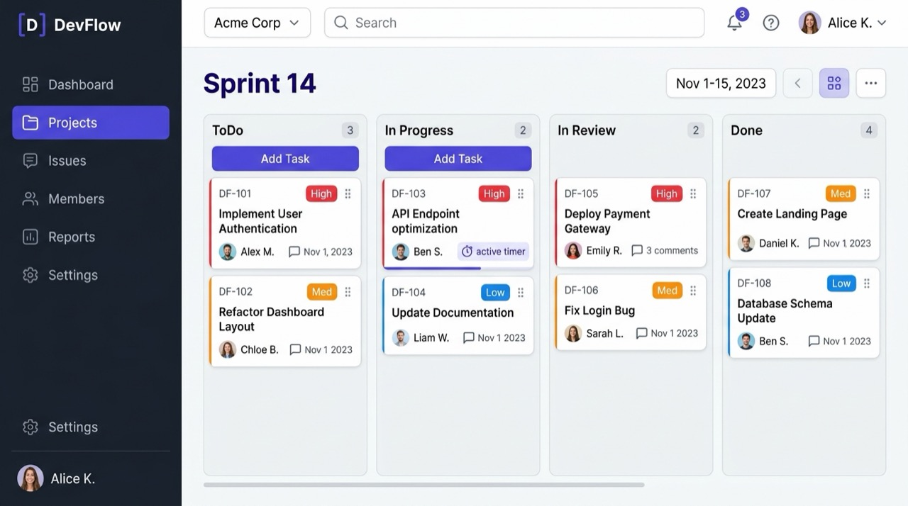
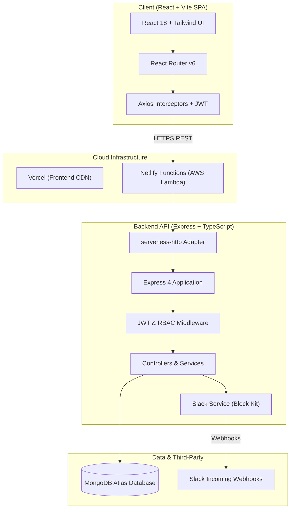

<div align="center">

# ⚡ DevFlow

### Modern Issue Tracking, Sprint Management & Collaborative Developer Platform

[](https://devflow123.vercel.app)
[](https://devflow-backend.netlify.app)
[](https://react.dev/)
[](https://www.typescriptlang.org/)
[](https://nodejs.org/)
[](https://www.mongodb.com/)
[](https://tailwindcss.com/)
[](https://api.slack.com/)

[**Live Demo (Frontend)**](https://devflow123.vercel.app) • [**Live API (Backend)**](https://devflow-backend.netlify.app/api/health) • [**Documentation**](#-api-endpoints)

<br />



</div>

---

## 📖 Overview

**DevFlow** is a full-stack, enterprise-grade project and issue management platform designed for agile engineering teams. It combines the responsiveness of a modern React SPA with a serverless Node.js REST API, featuring multi-tenant organization workspaces, granular Role-Based Access Control (RBAC), interactive Kanban boards, and real-time Slack notifications.

---

## ✨ Key Features

### 🏢 Multi-Tenant Workspaces & RBAC
- **Multi-Organization Architecture**: Users can create, switch between, and manage multiple independent organization workspaces.
- **Granular Role-Based Permissions**:
  - `OWNER`: Full administrative power, workspace settings, member management, project deletion.
  - `ADMIN`: Project management, member invitation, role changes, issue deletion.
  - `MEMBER`: Create and update issues, move cards on Kanban board, post comments.
  - `VIEWER`: Read-only access to boards, backlogs, and audit logs.

### 📋 Interactive Sprint & Kanban Management
- **Visual Kanban Board**: Drag-and-drop / click-to-move issue progression (`TODO`, `IN_PROGRESS`, `IN_REVIEW`, `DONE`).
- **Priority & Categorization**: Tags for `URGENT`, `HIGH`, `MEDIUM`, `LOW` priority levels and issue types (`BUG`, `FEATURE`, `TASK`, `IMPROVEMENT`).
- **Issue Details & Discussions**: Markdown-enabled descriptions, threaded comment lists, assignee selectors, and due-date tracking.

### 🔔 Real-Time Slack Integration
- **Incoming Webhooks**: Instant Slack channel notifications with rich Block Kit formatting when:
  - New tickets are created.
  - Ticket statuses change (e.g. `IN_PROGRESS` $\rightarrow$ `DONE`).
  - Team members post comments on issues.
- **Interactive Slash Commands**: Run `/devflow create <title>` and `/devflow list` straight from Slack.
- **One-Click Testing**: Test Slack webhook configuration directly from the Workspace Integrations settings page.

### 🔐 Authentication & Security
- **Dual Authentication**: JWT-based email/password authentication + Google OAuth 2.0 Single Sign-On (SSO).
- **Password Protection**: Salted password hashing with `bcryptjs`.
- **API Security**: `helmet` headers, strictly configured CORS policies, and token validation interceptors.

---

## 🏗️ System Architecture



---

## 🛠️ Tech Stack

### Frontend (`/client`)
- **Framework**: [React 18](https://react.dev/) + [Vite](https://vitejs.dev/) + [TypeScript](https://www.typescriptlang.org/)
- **Styling**: [Tailwind CSS](https://tailwindcss.com/)
- **Routing**: [React Router v6](https://reactrouter.com/)
- **Icons**: [Lucide React](https://lucide.dev/)
- **Auth**: [@react-oauth/google](https://www.npmjs.com/package/@react-oauth/google)
- **HTTP Client**: [Axios](https://axios-http.com/)

### Backend (`/server`)
- **Runtime**: [Node.js](https://nodejs.org/) with [TypeScript](https://www.typescriptlang.org/)
- **Framework**: [Express.js](https://expressjs.com/)
- **Database ORM**: [Mongoose](https://mongoosejs.com/) + [MongoDB Atlas](https://www.mongodb.com/atlas)
- **Serverless Adapter**: [serverless-http](https://github.com/dougmoscrop/serverless-http)
- **Integrations**: [Slack Incoming Webhooks](https://api.slack.com/messaging/webhooks)
- **Security**: [Helmet](https://helmetjs.github.io/), [CORS](https://expressjs.com/en/resources/middleware/cors.html), [jsonwebtoken](https://github.com/auth0/node-jsonwebtoken), [bcryptjs](https://github.com/dcodeIO/bcrypt.js)

---

## 🚀 Quick Start (Local Development)

### Prerequisites
- [Node.js](https://nodejs.org/) (v18 or higher)
- [npm](https://www.npmjs.com/)
- [MongoDB](https://www.mongodb.com/) (local instance or MongoDB Atlas URI)

### 1. Clone the Repository
```bash
git clone https://github.com/bhaskar2006-hub/DevFlow.git
cd DevFlow
```

### 2. Backend Setup (`/server`)
```bash
cd server
npm install
```

Create a `.env` file in `server/`:
```env
PORT=5000
NODE_ENV=development
MONGODB_URI=mongodb://localhost:27017/devflow
JWT_SECRET=your_super_secret_jwt_key_here
CORS_ORIGIN=http://localhost:5173
```

Run database seed script (optional, creates sample team & tickets):
```bash
npm run seed
```

Start the backend development server:
```bash
npm run dev
```

### 3. Frontend Setup (`/client`)
```bash
cd ../client
npm install
```

Create a `.env` file in `client/`:
```env
VITE_API_URL=http://localhost:5000/api
VITE_GOOGLE_CLIENT_ID=your_google_oauth_client_id.apps.googleusercontent.com
```

Start the Vite development server:
```bash
npm run dev
```

Open [http://localhost:5173](http://localhost:5173) in your browser.

---

## 🔑 Default Seed Credentials

If you ran `npm run seed`, you can test with these pre-configured team accounts (Password: `password123`):

| Role | Email | Permissions |
| :--- | :--- | :--- |
| **Owner** | `bhaskar@devflow.io` | Full Workspace Control & Settings |
| **Admin** | `sarah.connor@devflow.io` | Manage Projects & Members |
| **Member** | `david.miller@devflow.io` | Create, Edit & Move Issues |
| **Viewer** | `elena.rostova@devflow.io` | Read-Only Access |

---

## 📡 API Endpoints

### 🔐 Authentication
- `POST /api/auth/register` — Register a new user account
- `POST /api/auth/login` — Log in with email & password
- `POST /api/auth/google` — Google OAuth 2.0 Single Sign-On
- `GET /api/auth/me` — Get current authenticated user profile
- `PATCH /api/auth/me` — Update user profile details

### 🏢 Organizations & Workspaces
- `GET /api/organizations` — List all organizations for current user
- `POST /api/organizations` — Create a new workspace
- `GET /api/organizations/:id` — Get workspace details
- `PATCH /api/organizations/:id` — Update workspace settings (including Slack Webhook)
- `POST /api/organizations/:id/test-slack` — Test Slack Webhook notification
- `GET /api/organizations/:id/members` — List organization team members
- `POST /api/organizations/:id/members` — Invite a new member by email
- `PATCH /api/organizations/:id/members/:memberId` — Change member role (`ADMIN`, `MEMBER`, `VIEWER`)
- `DELETE /api/organizations/:id/members/:memberId` — Remove member from organization

### 📁 Projects
- `GET /api/projects/organization/:orgId` — List all projects in an organization
- `POST /api/projects` — Create a new project
- `GET /api/projects/:id` — Get project details
- `PATCH /api/projects/:id` — Update project metadata
- `DELETE /api/projects/:id` — Archive / delete project

### 🎫 Issues & Kanban Sprints
- `GET /api/issues` — Query & filter issues (by project, status, priority, assignee, search)
- `POST /api/issues` — Create a new issue (triggers Slack notification)
- `GET /api/issues/:id` — Get detailed issue view with comments
- `PATCH /api/issues/:id` — Update issue status, priority, or assignee
- `DELETE /api/issues/:id` — Delete issue

### 💬 Comments & Activity
- `GET /api/comments/issue/:issueId` — Get comments for an issue
- `POST /api/comments` — Add a new comment (triggers Slack notification)
- `GET /api/activities` — Organization audit history timeline

---

## 🌐 Deployment

### Backend on Netlify Functions
1. Connect repository to [Netlify](https://app.netlify.com/).
2. Netlify auto-detects `netlify.toml` with base directory `server`.
3. Set environment variables on Netlify:
   - `MONGODB_URI`: `mongodb+srv://...`
   - `JWT_SECRET`: `your_random_secret`
   - `NODE_ENV`: `production`
   - `CORS_ORIGIN`: `https://devflow123.vercel.app`

### Frontend on Vercel
1. Import repository on [Vercel](https://vercel.com/).
2. Set **Root Directory** to `client`.
3. Set environment variables:
   - `VITE_API_URL`: `https://devflow-backend.netlify.app/api`

---

## 📄 License

This project is licensed under the [MIT License](LICENSE).
